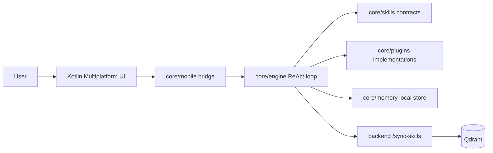

# UpCraft Agent

UpCraft Agent is a universal, privacy-first AI OS:
- runs on Android and Desktop
- uses a lightweight Go core ("Brain")
- executes deterministic compiled skills ("Tools")
- syncs skill knowledge from a cloud RAG backend

## Architecture



## 5-Minute Start

1. Clone repo
2. Run tests:
```bash
make test
```
3. Build desktop harness:
```bash
make build-desktop
./bin/upcraft-cli
```

## Repo Layout

- `core/`: Go brain, memory, skills, plugins
- `app/`: Kotlin Multiplatform body (Android/Desktop)
- `backend/`: cloud sync API + Qdrant integration
- `playground/`: quick isolated plugin harnesses
- `scripts/`: contributor automation

## Contribute a Skill

1. Scaffold files:
```bash
make new-skill name=weather
```
2. Implement logic in:
- `core/plugins/weather/plugin.go`
3. Wire it into registry/engine:
- `core/engine/registry.go`
4. Run checks:
```bash
make test
```
5. Open PR.

## Good First Skills

- `Weather`
- `News`
- `StockTicker`
- `HackerNews`

## Android Build

Generate AAR bridge:
```bash
make build-android-lib
```

Output:
- `app/shared/libs/upcraft_core.aar`

## Legacy Reference Code

PicoClaw migrated code exists under `core/**/picoclaw` and is isolated using:
- `//go:build legacy`

Default builds do not include legacy code.  
To include it explicitly:
```bash
go test -tags legacy ./...
```
